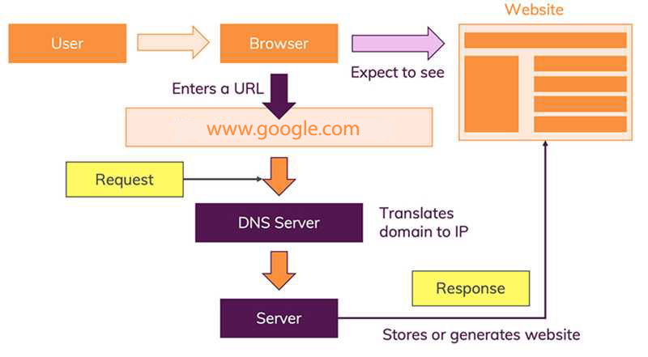

# Introductory HTML and JavaScript

##  How the web works ?

Let’s start with the most obvious way of using the internet: You visit a website like google.com.
The moment you enter this address in your browser and you hit ENTER, a lot of different things happen:

1. The URL gets resolved
2. Contact the (DNS) servers
3. Obtain the IP address associated with the requested domain name.
4. A Request is sent to the server of the website
5. The response of the server is parsed
6. The page is rendered and displayed

## Structure

### HTML
It is refer to hyper text mark up langauge. You have to know it is not a programming language instead it is a way of structuring data on the web using special write to do this purpose. In HTML we wrap every piece of data in tags that tags define how to present thies information. Tags it has two brakets and a charters between them like 
data
 each tag has an opening and closeing and every tag has it purpose. The opening tags can carry attributes, which tell us more about the content of that element. and every attribue has a name and value.

**Check this image to see how we structue data using html**

* The <html> element is the root element of an HTML page
* The <head> element contains meta information about the HTML page
* The <title> element specifies a title for the HTML page (which is shown in the browser's title bar or in the page's tab)
* The <body> element defines the document's body, and is a container for all the visible contents, such as headings, paragraphs,  images, hyperlinks, tables, lists, etc.
* The <h1> element defines a large heading
* The 
 element defines a paragraph