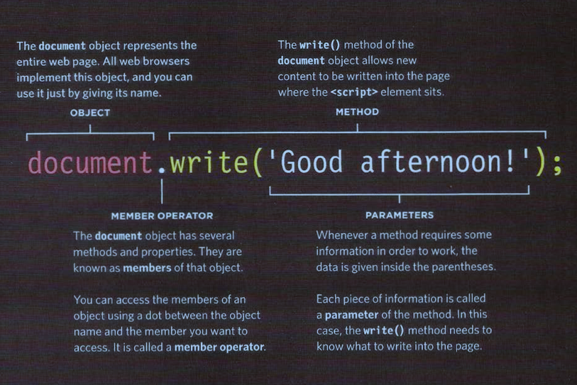

# Introductory HTML and JavaScript

##  How the web works ?

Let’s start with the most obvious way of using the internet: You visit a website like google.com.
The moment you enter this address in your browser and you hit ENTER, a lot of different things happen:

1. The URL gets resolved
2. Contact the (DNS) servers
3. Obtain the IP address associated with the requested domain name.
4. A Request is sent to the server of the website
5. The response of the server is parsed
6. The page is rendered and displayed


## Structure

### HTML
It is refer to hyper text mark up langauge. You have to know it is not a programming language instead it is a way of structuring data on the web using special write to do this purpose. In HTML we wrap every piece of data in tags that tags define how to present thies information. Tags it has two brakets and a charters between them like <p>data</p> each tag has an opening and closeing and every tag has it purpose. The opening tags can carry attributes, which tell us more about the content of that element. and every attribue has a name and value.

**Check this image to see how we structue data using html**


* The `<html>` element is the root element of an HTML page
* The `<head>` element contains meta information about the HTML page
* The `<title>` element specifies a title for the HTML page (which is shown in the browser's title bar or in the page's tab)
* The `<body>` element defines the document's body, and is a container for all the visible contents, such as headings, paragraphs,  images, hyperlinks, tables, lists, etc.
* The `<h1>` element defines a large heading
* The `<p>` element defines a paragraph

## Extra Markup
### DOCTYPES
The `<!DOCTYPE html>` declaration is used to inform a website visitor's browser that the document being rendered is an HTML document. While not actually an HTML element itself, every HTML document should being with a DOCTYPE declaration to be compliant with HTML standards.
### Comments in HTML
You can add comments to your HTML source by using the following syntax:

`<!-- Write your comments here -->`

### ID attribute
The id attribute specifies a unique id for an HTML element (the value must be unique within the HTML document).
The id attribute is most used to point to a style in a style sheet, and by JavaScript (via the HTML DOM) to manipulate the element with the specific id.

`<h1 id="myHeader">Hello World!</h1>`

### Class attribute
The class attribute in HTML is used to set one or more classnames for an element. With the specified class name you can work it through CSS and point in a stylesheet.

```
<!DOCTYPE html>
<html>
<head>
<style>
h2.demo {
   color: orange;
   background-color: black;
}
</style>
</head>
<body>
<h1>Resources</h1>
   <h2 class="demo">Text Tutorials</h1>
   <h2 class="demo">Video Tutorials</h1>
   <h2 class="demo">Interview Questions and Answers</h1>
   <h2 class="demo">Online Quiz</h1>
</body>
</html>
```

### Block Elements
A block-level element always starts on a new line and takes up the full width available (stretches out to the left and right as far as it can).

Example:

`<div>Hello World</div>`


### Inline Elements
An inline element does not start on a new line and only takes up as much width as necessary.

Example:

`<span>Hello World</span>`

### Grouping text & Elements in a block
The `<div>` element does not inherently represent anything. Instead, it's used to group content so it can be easily styled using the class or id attributes.

Example:
```
<div class="warning">
    
    <p>Beware of the leopard</p>
</div>
```

### Grouping text & Elements inline
Spans are similar to divs, except they are inline elements. You might use them to group words together, since words appear inline and not each on their own line.

Example:

`<p>Note: this is an editorial piece and does not reflect the official opinion of the <span>Sun Journal.</span></p>`


### Iframe
 The `<iframe>` tag defines a rectangular region within the document in which the browser can display a separate document, including scrollbars and borders. An inline frame is used to embed another document within the current HTML document.

### The `<meta>` tag
The META elements can be used to include name/value pairs describing properties of the HTML document, such as author, expiry date, a list of keywords, document author etc.
The <meta> tag is used to provide such additional information. This tag is an empty element and so does not have a closing tag but it carries information within its attributes.

```
<!DOCTYPE html>
<html>
<head>
<title>Information About Your Pages</title> <meta name="description"
content="An Essay on Installation Art" /> <meta name="keywords"
content="installation, art, opinion" /> <meta name="robots"
content="nofollow" /> <meta http-equiv="author"
content="Jon Duckett" /> <meta http-equiv="pragma"
content="no-cache" /> <meta http-equiv="expires"
content="Fri, 04 Apr 2014 23:59:59 GMT" /> </head>
<body>
  </body>
</html>
```

### Escape Characters

Escapes or unescapes an HTML file removing traces of offending characters that could be wrongfully interpreted as markup.

**The following characters are reserved in HTML and must be replaced with their corresponding HTML entities:**
```
" is replaced with &quot;
& is replaced with &amp;
< is replaced with &lt;
> is replaced with &gt;
```
## HTML5 layout
Html went through some improvements to come to it is final version which called html5.
Html5 interduced a new way of using tags it is repalsed using `<dev></dev>` tags with new tags the aim of it just to make the document readable and meaningfull.


## Process & Design
Building websites or web application is not hard if you do it right. Any good developer can build a website in few days or maybe just in few hours depenging on the scal of the project. But the main key here is this website achieve the goal for which it was created ?. I don't thinks so. You should build your website with a plan that  starts with gathring some inforamtion a bout the targeted audiance and this stage of building the website called Design. 

### What questions should I ask to understand the audience's needs?
1. Who is the site For ?

Every website should be designed for the target audience and not just for yourself or the site owner.You should know if your vistitors are individuals or companies and if they are individuals you should know thier age and the area they live in .. etc.

2. Why PeoPle visit your Website ?

Here you should search for your vistors Key motivations and specific goals.

3. What your visitors are trying to achieve ?

You should create a list of reasons why people would be coming to your site. 

4. What information your visitors need ?

Now you need to work out what information they need in order to achieve their goals quickly and effectively.

5. How often people will visit your site ?

Working out how often people are likely to revisit your site gives you an indication for how often you should update the site.

### Site maps
After you gather the informations that you need you should start to organize them in hierarchical manner.


### WireFrames
A wireframe is a simple sketch of the key information that needs to go on each page of a site. It shows the hierarchy of the information and how much space it might require.
The wireframes make design easier because you know what information needs to appear on which page before considering
how the the page should look.


### Getting your message across using Design
- Design is about communication. Visual hierarchy helps visitors understand what you are trying to tell them.
- You can differentiate between pieces of information using size, color, and style.
- You can use grouping and similarity to help simplify the information you present.

## The ABC of Programming

### What is a script and how do I create one ?

A script is a series of instructions that a computer can follow to achieve a goal. To write a script, you need to first state your goal and then list the tasks that need to be completed in order to achieve it.

### Designing a script tasks

When you pick a goal for your software if it's personal project or you working on project for client you should break down that goal into tasks to always achieve them.

You can consider talking to the client to write down the tasks to achieve that goal. Then you probaply would like to draw a flowchart to see things clearly.

see this example of a flowchart that describs the tasks of solving problem related to a lamp not working


there is a big task you con break it down to steps. These steps are the foundation stones
of your software. So after you define your steps you can go to coding. But you might consider that computers approach tasks in a different way than humans, so your instructions must let the computer solve the task prggrammatically.

### How do computers fit in with the world around them ?
Computers create models of the world using data and this models use objects to represent physical things.
Objects can have:
- **Properties**: tell us about the object
- **Methods**: perform tasks using the properties of the object
- **Events**: triggered when a user interacts with the computer

### How a browser sees a web page ?
1. Receive a page as Html code. 
2. Create a model of the page and store it in memory. 
3. Use a rendering engine to show the page on screen. 


### How Html,Css & JavaScript fit together ? 
- **html** (Content Layer): This is where the content of the page lives. The HTML gives the page structure and adds semantics.
- **Css** (Presentation Layer): The CSS enhances the HTML page with rules that state how the HTML content is presented.
- **JavaScript** (Behavior Layer) : This is where we can change how the page behaves, adding interactivity.

These three layers form the basis of a popular approach to building web pages called progressive enhancement.

### How do I write a script for a web page ?
-  It is best to keep JavaScript code in its own JavaScript file. JavaScript files are text files (like HTML pages and CSS style sheets), but they have the . j s extension.
- The HTML `<script>` element is used in HTML pages to tell the browser to load the JavaScript file.
-  If you view the source code of the page in the browser, the JavaScript will not have changed the HTML, because the script works with the model of the web page that the browser has created.

### How to use Objects & Methods ?


### **NOTE**: 
JavaScript runs where it is found in the Html. When the browser comes across a `<script>`element, it stops to load the script and then checks to see if it needs to do anything.

