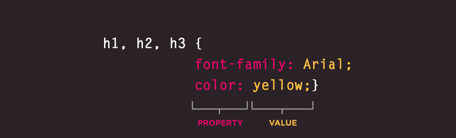

# Basics of HTML, CSS & JS

## HTML & CSS
## Structural markup

The elements that you can use to describe both headings and paragraphs.

### Headings

HTML headings are titles or subtitles that you want to display on a webpage.
`<h1>` defines the most important heading. `<h6>` defines the least important heading.

```
<h1>Heading 1</h1>
<h2>Heading 2</h2>
<h3>Heading 3</h3>
<h4>Heading 4</h4>
<h5>Heading 5</h5>
<h6>Heading 6</h6>
```

### Paragraphs

A paragraph always starts on a new line, and is usually a block of text.

`<p>This is a paragraph.</p>`

### Bold & Italic

**Bold**

The HTML `<b>` element defines bold text, without any extra importance.

`<b>This text is bold</b>`

_Italic_

The HTML `<i>` element defines italic text, without any extra importance.

`<i>This text is italic</i>`

### Subscript & Superscript

The `<sub>` tag defines subscript text. Subscript text appears half a character below the normal line.

The `<sup>` tag defines superscript text. Superscript text appears half a character above the normal line.

### Line break & Horizontal Rules

The `<br>` tag inserts a single line break.

The `<hr>` element is most often displayed as a horizontal rule that is used to separate content (or define a change) in an HTML page.

## Semantic Markup

### Strong & Emphasis

The `<strong>` tag is used to define text with strong importance. The content inside is typically displayed in **bold**.

The `<em>` tag is used to define emphasized text. The content inside is typically displayed in _italic_.

### Quotations

The `<blockquote>` tag indicates that the enclosed text is an extended quotation.

The `<q>` tag defines a short quotation.

### Abbreviations & Acronyms

The `<abbr>` tag defines an abbreviation or an acronym, like "HTML", "CSS", "Mr.", "Dr.", "ASAP", "ATM".

### Citation & Definitions

The `<cite>` tag defines the title of a creative work (e.g. a book, a poem, a song, a movie, a painting, a sculpture, etc.).

The `<dfn>` tag stands for the "definition element", and it specifies a term that is going to be defined within the content.

### Auther Details

The `<address>` tag defines the contact information for the author/owner of a document or an article.

### Changes to content

The `<ins>` tag defines a text that has been inserted into a document. Browsers will usually underline inserted text.

The `<del>` tag defines text that has been deleted from a document. Browsers will usually strike a line through deleted text.

The `<s>` tag specifies text that is no longer correct, accurate or relevant. The text will be displayed with a line through it.

## Introducing CSS

Css works by associating rules with Html elements. These rules specify how the element should be displayed.
a Css rule conatins to parts, selector and a decleration.


Css rule can have more than one decleration. And any decleration contain two parts: property and value



### Using ExternaL Css

The best practise of using css is to include all the rules in external file with .css extention and link it on your document using this tag

`<link href="css/styles.css" type="text/css" rel="stylesheet" />`

- **href** :This specifies the path to the CSS file (which is often placed in a folder called css or styles).
- **type**: This attribute specifies the type of document being linked to. The value should be text/css.
- **rel**: This specifies the relationship between the HTML page and the file it is linked to. The value should be stylesheet when linking to a CSS file.

### Using Internal Css

You can also use css inside the head tag of your document by adding the css rules within `<style>` tag

```
<head>
<title>Using Internal CSS</title> <style type="text/css">
body {
font-family: arial; background-color: rgb(185,179,175);}
h1 {
color: rgb(255,255,255);}
    </style>
  </head>
```

### Css selectors 

its the way to select the element or elements that we wish to apply some css rules on it.
there is many types of selectors. See this table.

Selector | Example | description
--------- | --------- | ---------
.class | .intro | Selects all elements with class="intro"
#id	| #firstname | Selects the element with id="firstname"
/* | /* | Selects all elements
element | p | Selects all `<p>` elements
element,element,..	| div, p | Selects all `<div>` elements and all `<p>` elements

### How css ruLes cascade ?

There are 4 rules that govirn this:

- **Sort by Importance**

If there are any conflicts in your css, there is an order of importance in which some selectors are more important than others:

an ID will win out over a class

a class will win out over a tag

- **Sort by weight**

The styles are checked in the following order, each subsequent style sheet has a greater weight than the previous.

Default: Browser

User: Style Sheet

Author: Style Sheet - Linked

Author: Style Sheet - Embedded in the head of the web page

Author: Style Sheet - Inline within the body of the web page


- **Sort by Specificity**

Determines how specific the rule is

```
#content{
color: #333
}

#content p{
color: #f00
}

#content p em{
color: #f00
}
```

The last rule above wins out because it is the most specific of the three.


- **Sort by Order**

If two rules have the same properties, specificy and values the one that appears later in the css will be the one that the browser uses but `! importance` has more weight than anything else regardless of its position within the style sheet;

```
p em{
color: #f00 !important;
}
```

### Inheritance in css

Inheritance is the mechanism by which certain properties are passed on from a parent element down to its children, in the same fashion as genetics: if parents have blue eyes, their children will probably also have blue eyes.

Not all CSS properties are inherited, because it does not make sense for some of them to be. For instance, margins and width are not inherited


## Basic JavaScript Instructions

### What is JavaScript?

It is a scripting language that enables you to create dynamically updating content, control multimedia, animate images, and pretty much everything else. (Okay, not everything, but it is amazing what you can achieve with a few lines of JavaScript code.)It consider high level programing language and it is intrepted language which mean it excuted line by line.

 It is best to keep JavaScript code in its own JavaScript file. JavaScript files are text files (like HTML pages and CSS style sheets), but they have the .js extension.

If you view the source code of the page in the browser, the JavaScript will not have changed the HTML, because the script works with the model of the web page that the browser has created.

###  Variables
A script will have to temporarily store the bits of information it needs to do its job. It can store this data in variables.

### How I can declare a variable ?

You should use key word Var and then type the name of the variable and you can assign value to it as the following figure


### There is some rules of how we can name the variable:
- Variable names cannot contain spaces.
- Variable names must begin with a letter, an underscore (_) or a dollar sign ($).
- Variable names can only contain letters, numbers, underscores, or dollar signs.
- Variable names are case-sensitive.
- Certain words may not be used as variable names, because they have other meanings within JavaScript.

### Datatype in Javascript ?
### there is three main primitive data type to be considered now 
- Boolean — true or false
- Number — integers, floats, etc
- String — an array of characters i.e words

### javascript comments
When writing code you may have some complex logic that is confusing, this is a perfect opportunity to include some comments in the code that will explain what is going on. Not only will this help you remember it later on, but if you someone else views your code, they will also be able to understand the code (hopefully)!

### creating single line comments
To create a single line comment in JavaScript, you place two slashes "//" in front of the code or text you wish to have the JavaScript interpreter ignore. When you place these two slashes, all text to the right of them will be ignored, until the next line.

```javscript
<script type="text/javascript">
<!--
// This is a single line JavaScript comment

document.write("I have comments in my JavaScript code!");
//document.write("You can't see this!");
//-->
</script>
```
### creating multi-line comments
Although a single line comment is quite useful, it can sometimes be burdensome to use when disabling long segments of code or inserting long-winded comments. For this large comments you can use JavaScript's multi-line comment that begins with /* and ends with */.

```javascript
<script type="text/javascript">
<!--
document.write("I have multi-line comments!");
/*document.write("You can't see this!");
document.write("You can't see this!");
document.write("You can't see this!");
document.write("You can't see this!");
document.write("You can't see this!");
document.write("You can't see this!");
document.write("You can't see this!");*/
//-->
</script>
```

### Arrays

An array is a special variable, which can hold more than one value at a time.

`var cars = ["Saab", "Volvo", "BMW"];`

#### other way of creating an array

The following example also creates an Array, and assigns values to it:

`var cars = new Array("Saab", "Volvo", "BMW");`

#### Access the Elements of an Array

You access an array element by referring to the index number.

This statement accesses the value of the first element in cars:

`var name = cars[0];`

#### Changing an Array Element

This statement changes the value of the first element in cars:

`cars[0] = "Opel";`


### Expressions

An expression evaluates into (results in) a single value. Broadly speaking there are two types of expressions.

1. Expression that just assign a value to a variable.

`var color = 'beige';`

2. Expression tht use two or more values to return a single value.

`var area = 3 * 2;`

 Expressions rely on things called operators; they allow programmers to create a single value from one or more values.

#### Arithmetic Expressions:
Arithmetic expressions evaluate to a numeric value. Examples include the following

```javascript
10;     // Here 10 is an expression that is evaluated to the numeric value 10 by the JS interpreter
10+13; // This is another expression that is evaluated to produce the numeric value 23
```

#### String Expressions:
String expressions are expressions that evaluate to a string. Examples include the following

```javascript
'hello';
'hello' + 'world'; // evaluates to the string 'hello world'
```

#### Logical Expressions:
Expressions that evaluate to the boolean value true or false are considered to be logical expressions. This set of expressions often involve the usage of logical operators && (AND), ||(OR) and !(NOT). Examples include

```javascript
10 > 9;   // evaluates to boolean value true
10 < 20;  // evaluates to boolean value false
true;     //evaluates to boolean value true
a===20 && b===30; // evaluates to true or false based on the values of a and b
```

### Operators

### Comparison Operators

JavaScript language includes operators that compare two operands and return Boolean value true or false.

Operators | Description
------------ | -------------
==	| Compares the equality of two operands without considering type.
===	| Compares equality of two operands with type.
!=	| Compares inequality of two operands.
>	| Checks whether left side value is greater than right side value. If yes then returns true otherwise false.
<	| Checks whether left operand is less than right operand. If yes then returns true otherwise false.
>=	| Checks whether left operand is greater than or equal to right operand. If yes then returns true otherwise false.
<=	| Checks whether left operand is less than or equal to right operand. If yes then returns true otherwise false.

The following example demonstrates how comparison operators perform different tasks.

#### Example: Comparison Operators
```javascript
var a = 5, b = 10, c = "5";
var x = a;

a == c; // returns true

a === c; // returns false

a == x; // returns true

a != b; // returns true

a > b; // returns false

a < b; // returns true

a >= b; // returns false

a <= b; // returns true

a >= c; // returns true

a <= c; // returns true
```

### Logical Operators

Logical operators are used to combine two or more conditions. JavaScript includes following logical operators.

Operators | Description
------------ | -------------
&& | is known as AND operator. It checks whether two operands are non-zero 
\|\| | is known as OR operator. It checks whether any one of the two operands is non-zero 
!  | is known as NOT operator. It reverses the boolean result of the operand (or condition)

#### Example: Logical Operators

```javascript
var a = 5, b = 10;

(a != b) && (a < b); // returns true

(a > b) || (a == b); // returns false

(a < b) || (a == b); // returns true

!(a < b); // returns false

!(a > b); // returns true
```

### Arithmetic Operators
Arithmetic operators are used to perform arithmetic between variables and/or values.

Given that y = 5, the table below explains the arithmetic operators:

Operator | Description | Example | Result in y | Result in x
--------- | --------- | --------- | --------- |--------- 	
+	| Addition	| x = y + 2	| y = 5	| x = 7	
-	| Subtraction	| x = y - 2	| y = 5	| x = 3	
*	| Multiplication	| x = y * 2	| y = 5	| x = 10	
/	| Division	| x = y / 2	| y = 5	| x = 2.5	
%	| Modulus  | x = y % 2 | y = 5 | x = 1	
++	| Increment	| x = ++y	| y = 6	| x = 6	
--	| Decrement	| x = --y	| y = 4	| x = 4	

### String Operators
The + operator, and the += operator can also be used to concatenate (add) strings.

Given that text1 = "Good ", text2 = "Morning", and text3 = "", the table below explains the operators:

Operator | Example | text1 | text2 | text3	
+	| text3 = text1 + text2	| "Good "	| "Morning"	 | "Good Morning"	
+=	| text1 += text2	| "Good Morning"	| "Morning"	| ""

### Conditional Statements

Very often when you write code, you want to perform different actions for different decisions.

You can use conditional statements in your code to do this.

Use `if` to specify a block of code to be executed, if a specified condition is true
Use `else` to specify a block of code to be executed, if the same condition is false
Use `else if` to specify a new condition to test, if the first condition is false

#### Example
```
if (condition1) {
  //  block of code to be executed if condition1 is true
} else if (condition2) {
  //  block of code to be executed if the condition1 is false and condition2 is true
} else {
  //  block of code to be executed if the condition1 is false and condition2 is false
}
```
