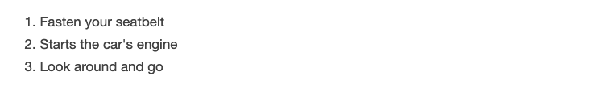
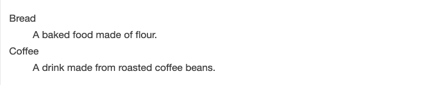

# HTML Lists, CSS Boxes, JS Control Flow

## HTML Lists

There is three types of list in HTML

1.  Unordered list — Used to create a list of related items, in no particular order.
2.  Ordered list — Used to create a list of related items, in a specific order.
3.  Description list — Used to create a list of terms and their descriptions.

let see some examples for each one of them.

**Example: HTML Unordered Lists**

``` html
<ul>
    <li>Chocolate Cake</li>
    <li>Black Forest Cake</li>
    <li>Pineapple Cake</li>
</ul>
```
output is:

;

**Example: HTML Ordered Lists**

``` html
<ol>
    <li>Fasten your seatbelt</li>
    <li>Starts the car's engine</li>
    <li>Look around and go</li>
</ol>
```
output is:

;

The numbering of items in an ordered list typically starts with 1. However, if you want to change that you can use the start attribute, as shown in the following example:

```html
<ol start="10">
    <li>Mix ingredients</li>
    <li>Bake in oven for an hour</li>
    <li>Allow to stand for ten minutes</li>
</ol>
```

**Example: HTML Description Lists**

The description list is created using <dl> element. The <dl> element is used in conjunction with the <dt> element which specify a term, and the <dd> element which specify the term's definition.

``` html
<dl>
    <dt>Bread</dt>
    <dd>A baked food made of flour.</dd>
    <dt>Coffee</dt>
    <dd>A drink made from roasted coffee beans.</dd>
</dl>
```
output is:

;

*Note*: You can modify style of all the above lists using css

```html
ol {
    list-style-type: upper-roman;
}
```
this rule changes the marker type to roman numbers in ordered list.