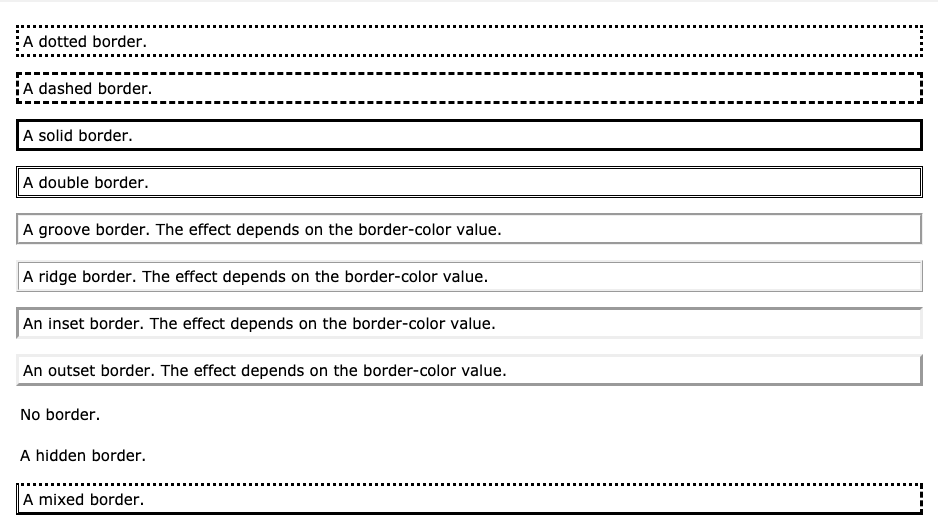

# HTML Lists, CSS Boxes, JS Control Flow

## HTML Lists

There is three types of list in HTML

1.  Unordered list — Used to create a list of related items, in no particular order.
2.  Ordered list — Used to create a list of related items, in a specific order.
3.  Description list — Used to create a list of terms and their descriptions.

let see some examples for each one of them.

**Example: HTML Unordered Lists**

``` html
<ul>
    <li>Chocolate Cake</li>
    <li>Black Forest Cake</li>
    <li>Pineapple Cake</li>
</ul>
```
output is:

;

**Example: HTML Ordered Lists**

``` html
<ol>
    <li>Fasten your seatbelt</li>
    <li>Starts the car's engine</li>
    <li>Look around and go</li>
</ol>
```
output is:

;

The numbering of items in an ordered list typically starts with 1. However, if you want to change that you can use the start attribute, as shown in the following example:

```html
<ol start="10">
    <li>Mix ingredients</li>
    <li>Bake in oven for an hour</li>
    <li>Allow to stand for ten minutes</li>
</ol>
```

**Example: HTML Description Lists**

The description list is created using <dl> element. The <dl> element is used in conjunction with the <dt> element which specify a term, and the <dd> element which specify the term's definition.

``` html
<dl>
    <dt>Bread</dt>
    <dd>A baked food made of flour.</dd>
    <dt>Coffee</dt>
    <dd>A drink made from roasted coffee beans.</dd>
</dl>
```
output is:

;

*Note*: You can modify style of all the above lists using css

```html
ol {
    list-style-type: upper-roman;
}
```
this rule changes the marker type to roman numbers in ordered list.

## CSS Boxes

At first you should know that Css deal with every element in Html as it has a box.
and from their you will have some rules in css can be applied to manage these boxes.

**CSS Height and Width**

Set the height and width of another <div> element:

```css
div {
  height: 100px;
  width: 500px;
  background-color: powderblue;
}
```

**Setting max-width**

The max-width property is used to set the maximum width of an element.

The problem with the `<div>` above occurs when the browser window is smaller than the width of the element (500px). The browser then adds a horizontal scrollbar to the page.

Using max-width instead, in this situation, will improve the browser's handling of small windows

This `<div>` element has a height of 100 pixels and a max-width of 500 pixels: 

```css
div {
  max-width: 500px;
  height: 100px;
  background-color: powderblue;
}
```

**CSS Overflow**

The overflow property specifies whether to clip the content or to add scrollbars when the content of an element is too big to fit in the specified area.

The overflow property has the following values:

- visible - Default. The overflow is not clipped. The content renders outside the element's box
- hidden - The overflow is clipped, and the rest of the content will be invisible
- scroll - The overflow is clipped, and a scrollbar is added to see the rest of the content
- auto - Similar to scroll, but it adds scrollbars only when necessary

**CSS Border Properties**

The CSS border properties allow you to specify the style, width, and color of an element's border.

- Example

```css
p.dotted {border-style: dotted;}
p.dashed {border-style: dashed;}
p.solid {border-style: solid;}
p.double {border-style: double;}
p.groove {border-style: groove;}
p.ridge {border-style: ridge;}
p.inset {border-style: inset;}
p.outset {border-style: outset;}
p.none {border-style: none;}
p.hidden {border-style: hidden;}
p.mix {border-style: dotted dashed solid double;}
```

