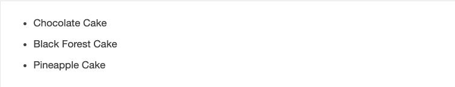

# HTML Lists, CSS Boxes, JS Control Flow

## HTML Lists

There is three types of list in HTML

1.  Unordered list — Used to create a list of related items, in no particular order.
2.  Ordered list — Used to create a list of related items, in a specific order.
3.  Description list — Used to create a list of terms and their descriptions.

let see some examples for each one of them.

**Example: HTML Unordered Lists**

```html
<ul>
  <li>Chocolate Cake</li>
  <li>Black Forest Cake</li>
  <li>Pineapple Cake</li>
</ul>
```

output is:

;

**Example: HTML Ordered Lists**

```html
<ol>
  <li>Fasten your seatbelt</li>
  <li>Starts the car's engine</li>
  <li>Look around and go</li>
</ol>
```

output is:

;

The numbering of items in an ordered list typically starts with 1. However, if you want to change that you can use the start attribute, as shown in the following example:

```html
<ol start="10">
  <li>Mix ingredients</li>
  <li>Bake in oven for an hour</li>
  <li>Allow to stand for ten minutes</li>
</ol>
```

**Example: HTML Description Lists**

The description list is created using <dl> element. The <dl> element is used in conjunction with the <dt> element which specify a term, and the <dd> element which specify the term's definition.

```html
<dl>
  <dt>Bread</dt>
  <dd>A baked food made of flour.</dd>
  <dt>Coffee</dt>
  <dd>A drink made from roasted coffee beans.</dd>
</dl>
```

output is:

;

_Note_: You can modify style of all the above lists using css

```html
ol { list-style-type: upper-roman; }
```

this rule changes the marker type to roman numbers in ordered list.

## CSS Boxes

At first you should know that Css deal with every element in Html as it has a box.
and from their you will have some rules in css can be applied to manage these boxes.

**CSS Height and Width**

Set the height and width of another <div> element:

```css
div {
  height: 100px;
  width: 500px;
  background-color: powderblue;
}
```

**Setting max-width**

The max-width property is used to set the maximum width of an element.

The problem with the `<div>` above occurs when the browser window is smaller than the width of the element (500px). The browser then adds a horizontal scrollbar to the page.

Using max-width instead, in this situation, will improve the browser's handling of small windows

This `<div>` element has a height of 100 pixels and a max-width of 500 pixels:

```css
div {
  max-width: 500px;
  height: 100px;
  background-color: powderblue;
}
```

**CSS Overflow**

The overflow property specifies whether to clip the content or to add scrollbars when the content of an element is too big to fit in the specified area.

The overflow property has the following values:

- visible - Default. The overflow is not clipped. The content renders outside the element's box
- hidden - The overflow is clipped, and the rest of the content will be invisible
- scroll - The overflow is clipped, and a scrollbar is added to see the rest of the content
- auto - Similar to scroll, but it adds scrollbars only when necessary

**CSS Border Properties**

The CSS border properties allow you to specify the style, width, and color of an element's border.

- Example

```css
p.dotted {
  border-style: dotted;
}
p.dashed {
  border-style: dashed;
}
p.solid {
  border-style: solid;
}
p.double {
  border-style: double;
}
p.groove {
  border-style: groove;
}
p.ridge {
  border-style: ridge;
}
p.inset {
  border-style: inset;
}
p.outset {
  border-style: outset;
}
p.none {
  border-style: none;
}
p.hidden {
  border-style: hidden;
}
p.mix {
  border-style: dotted dashed solid double;
}
```


you can add the css style to border with one lie using

**CSS Border - Shorthand Property**

The border property is a shorthand property for the following individual border properties:

border-width
border-style
border-color

```css
p {
  border: 5px solid red;
}
```

**Rounded border**
for rounded borders use radius

Example:

```css
p {
  border: 2px solid red;
  border-radius: 5px;
}
```

**CSS Margins**

The CSS margin properties are used to create space around elements, outside of any defined borders.

```css
p {
  margin-top: 100px;
  margin-bottom: 100px;
  margin-right: 150px;
  margin-left: 80px;
}
```

**CSS Padding**

The CSS padding properties are used to generate space around an element's content, inside of any defined borders.

```css
div {
  padding-top: 50px;
  padding-right: 30px;
  padding-bottom: 50px;
  padding-left: 80px;
}
```

**Centered content**

To allign text you can use text-allign property

```css
p {
  text-align: center;
}
```

**The display Property**

The display property specifies if/how an element is displayed.

Every HTML element has a default display value depending on what type of element it is. The default display value for most elements is block or inline.

- Examples of block-level elements:

```
<div>
<h1> - <h6>
<p>
<form>
<header>
<footer>
<section>
```

- Examples of inline elements:

```
<span>
<a>

```

_Note_: CSS3 has introduced the ability to create image borders and rounded borders.

## JS Control Flow

**Switch Statement**

The switch statement is used to perform different actions based on different conditions.

Syntax

```javascript
switch (expression) {
  case x:
    // code block
    break;
  case y:
    // code block
    break;
  default:
  // code block
}
```

This is how it works:

- The switch expression is evaluated once.
- The value of the expression is compared with the values of each case.
- If there is a match, the associated block of code is executed.
- If there is no match, the default code block is executed.

_Notes_:

- Comparison operators (===, !==, ==, !=, <, >, <=, =>) are used to compare two operands.
- Logical operators allow you to combine more than one set of comparison operators.

**While loop**

A while loop is a control flow statement that allows code to be executed repeatedly based on a given Boolean condition. The while loop can be thought of as a repeating if statement.
Syntax :

```javascript
while (boolean condition)
{
   loop statements...
}
```


How it works?

- While loop starts with the checking of condition. If it evaluated to true, then the loop body statements are executed otherwise first statement following the loop is executed. For this reason it is also called Entry control loop.

- Once the condition is evaluated to true, the statements in the loop body are executed. Normally the statements contain an update value for the variable being processed for the next iteration.

- When the condition becomes false, the loop terminates which marks the end of its life cycle.

**The Do/While Loop**

The do/while loop is a variant of the while loop. This loop will execute the code block once, before checking if the condition is true, then it will repeat the loop as long as the condition is true.

Syntax

```javascript
do {
  // code block to be executed
} while (condition);
```

**For loop**

for loop provides a concise way of writing the loop structure. Unlike a while loop, a for statement consumes the initialization, condition and increment/decrement in one line thereby providing a shorter, easy to debug structure of looping.
Syntax:

```javascript
for (initialization condition; testing condition;increment/decrement)
{
    statement(s)
}
```


How it works?

- Initialization condition: Here, we initialize the variable in use. It marks the start of a for loop. An already declared variable can be used or a variable can be declared, local to loop only.

- Testing Condition: It is used for testing the exit condition for a loop. It must return a boolean value. It is also an Entry Control Loop as the condition is checked prior to the execution of the loop statements.

- Statement execution: Once the condition is evaluated to true, the statements in the loop body are executed.
  Increment/ Decrement: It is used for updating the variable for next iteration.

- Loop termination:When the condition becomes false, the loop terminates marking the end of its life cycle.
