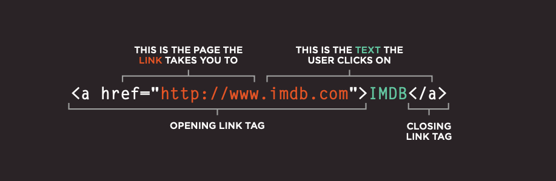
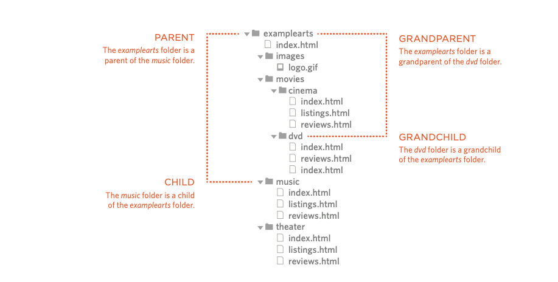

# HTML Links, CSS Layout, JS Functions

## HTML Links

HTML links are hyperlinks.You can click on a link and jump to another document.
When you move the mouse over a link, the mouse arrow will turn into a little hand.

Hyperlinks are defined with the HTML `<a>` tag:

`<a href="https://www.google.com/html/">Google</a>`

;

**Linking to a page in the same website**

```html
<p> <ul>
<li><a href="index.html">Home</a></li>
 <li><a href="about-us.html">About</a></li>
 <li><a href="movies.html">Movies</a></li>
 <li><a href="contact.html">Contact</a></li>
</ul> </p>
```

**Directory structure**

On a larg projects you should organize your code in files and folders with good name convention

;

**Relative URL**

Relative URLs can be used when linking to pages within your own website. They provide a shorthand way of telling the browser where to find your files

| Relative Link Type | Example                                          |
| ------------------ | ------------------------------------------------ |
| Same Folder        | `<a href="reviews.html">Reviews</a>`             |
| Child Folder       | `<a href="music/listings.html">Listings</a>`     |
| Grandchild Folder  | `<a href="movies/dvd/reviews.html"> Reviews</a>` |
| Parent Folder      | `<a href="../index.html">Home</a>`               |
| Grandparent Folder | `<a href="../../index.html">Home</a>`            |

**Email Linking**

Mailto link is a type of HTML link that activates the default mail client on the computer for sending an e-mail.

`<a href="mailto:name@email.com">Link text</a>`

**Open links in a new window**

You can use target attrbut to target your link to another window.

`<a href="http://www.imdb.com" target="_blank"> Internet Movie Database</a>`

**Linking to a specifice part of a page**

Here you must use an Id for that part you want the link to go to. See the Example

```html
<h2 id="interlude">Interlude</h2>
<a href="#interlude">Interlude</a>
```

If you want to go to a specfice part pf other page just include the #id after the link

`<a href="http:/www.htmlandcssbookcom/#bottom">`

# CSS Layout

**Normal Flow**

If you take an HTML webpage which has no CSS applied to change the layout, the elements will display in normal flow.


You can benfit of this normal flow to structure your page but If you wnat more control you may move away from the normal flow.

**Floats**

Floats are used to shift a box to the left or right, allowing content to display wrapped around it.

```css
.item {
    float: left;
}
```


**CLearing FLoats**

Once you have floated an element, all of the following elements will wrap around that floated element until they wrap underneath and normal flow continues. If you want to prevent that, you need to clear the float.

``` css
.clear {
    clear: both; 
}
```

*Note*: the most common when clearing floats is to set the overflow property to have a value other than the default visible.

```css
.container {
    overflow: auto;
}
```

**Positioning**

Remove an element from normal flow or shift it around from its place in normal flow, you can use the position property in CSS.

*RELATIVE POSITIONING*

If an item has position: relative then the reference point is the place it would normally be in normal flow.

```css
.item {
    position: relative;
    bottom: 50px;
}
```

*ABSOLUTE POSITIONING*

Set position: absolute on an item and it will be removed completely from normal flow.

You can then use offset values for the properties top, left, bottom and right to move the box from that position to where you want it to be.

```css
.item {
    position: absolute;
    top: 20px;
    right: 20px;
}
```

*FIXED POSITIONING*

Something with position: fixed will be positioned in most cases relative to the viewport, and removed from document flow so that no space is reserved for it.

```css
.item {
    position: fixed;
    top: 20px;
    left: 100px;
}
```

*STICKY POSITIONING*

Setting position: sticky on an element will cause the element to scroll with the document just as it would in normal flow, however, once it reaches a certain point in relation to the viewport (using the usual offsets) it “sticks” and starts to act like position: fixed.

```css
.item {
    position: sticky;
    top: 0;
}
```

## JS Functions

**Functions**

Quite often we need to perform a similar action in many places of the script. For example, we need to show a nice-looking message when a visitor logs in, logs out and maybe somewhere else.

Functions are the main “building blocks” of the program. They allow the code to be called many times without repetition.

**Function Declaration**

To create a function we can use a function declaration.
It looks like this:

```javascript
function showMessage() {
  alert( 'Hello everyone!' );
}
```
The function keyword goes first, then goes the name of the function, then a list of parameters between the parentheses (comma-separated, empty in the example above) and finally the code of the function, also named “the function body”, between curly braces.

```javascript
function name(parameters) {
  ...body...
}
```
Our new function can be called by its name: showMessage().
For instance:

```javascript
function showMessage() {
  alert( 'Hello everyone!' );
}
showMessage();
showMessage();
```

The call showMessage() executes the code of the function. Here we will see the message two times.
This example clearly demonstrates one of the main purposes of functions: to avoid code duplication.
If we ever need to change the message or the way it is shown, it’s enough to modify the code in one place: the function which outputs it.

**Anonymous Functions**

An anonymous function is a function without a name. An anonymous function is often not accessible after its initial creation.

```javascript
let show = function () {
    console.log('Anonymous function');
};

show();
```

**Immediately invoked function execution**

If you want to create a function and execute it immediately after declaration, you can use the anonymous function like this:

```javascript
(function() {
    console.log('IIFE');
})();
```

**Function expressions**

There is another syntax for creating a function that is called a Function Expression.

It looks like this:

```javascript
let sayHi = function() {
  alert( "Hello" );
};
```

## Pair Programming

Pair programming consists of two programmers sharing a single workstation (one screen, keyboard and mouse among the pair). The programmer at the keyboard is usually called the “driver”, the other, also actively involved in the programming task but focusing more on overall direction is the “navigator”; it is expected that the programmers swap roles every few minutes or so.

**Expected Benefits**
- increased code quality
- better diffusion of knowledge among the team
- better transfer of skills
- improved resiliency of a pair to interruptions
