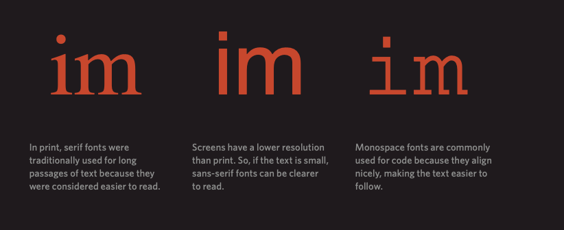
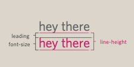

# HTML Images; CSS Color & Text

## Images

### Adding Image

Images can be easily inserted at any section in an HTML page. To insert image in an HTML page, use the  tags. It is an empty tag, containing only attributes since the closing tag is not required.


```html

```

### Aligning image

You can align image using align attribute

``

You have four choices for alignment : top, bottom, left, right

**Note**:

- Images with png formate is the best suit for screen displays.
- Images with vsg format are vector based and it is the ultimate choice when using logo or icons in your website.
- Images created for web should be saved at a resolution of 72ppi for optimization purpose.

### Figure and Figure caption

You can use `<figur>` tag to inclue a captions for the image element.

Example:

```html
<figure>
  
  <br />
  <figcaption>
    Sea otters hold hands when they sleep so they don't drift away from each
    other.
  </figcaption>
</figure>
```

## CSS Color

There are 4 color repersenation in css you can use

1. rgb values
2. hex codes
3. Color names
4. hsl values

### rgb values\*\*

These express colors in terms of how much _red_, _green_ and _blue_ are used to make it up.

```css
p {
  color: rgb(100, 100, 90);
}
```

### Hex codes

These are six-digit codes that represent the amount of red, green and blue in a color, preceded by a pound or hash #

```css
h2 {
  color: #ee3e80;
}
```

### Color names

There are _147_ predefined color names that are recognized by browsers.

```css
h1 {
  color: DarkCyan;
}
```

### Background color

background is considered to be the width and height of an element, plus any padding and borders (but not margins).
Using the CSS background-color property we can color the of a Html element

```css
body {
  background-color: rgb(200, 200, 200);
}
```

### HSL colors

HSL stands for Hue, Saturation, Lightness

- Hue is the color wheel starts from 0-360 and repersent the color.
- Saturation is how much grey in the color and it value repersent with percentage.
- Lightness is how much white in the color and it value reperesent with percentage.

```css
body {
  background-color: hsl(0, 0%, 78%);
}
```

### CSS3 Opacity

There is an opacity property you can add to your element to set it transparency within 0-1.
there is three way to set the opacity see the example

Example:

```css
p {
  opacity: 0.5;
  background-color: rgba(0, 0, 0, 0.5);
  background-color: hsla(0, 100%, 100%, 0.5);
}
```

## CSS Text

There is built in typface in most of browsers and it is :

- SERIF : Serif fonts have extra details on the ends of the letters.
- SNAS-SERIF: sans-serif fonts have straight ends to letter.
- MONOSPACE: Every letter have the same width.



**Font family**

The font family of a text is set with the font-family property.

```css
.serif {
  font-family: "Times New Roman", Times, serif;
}
```

**Font Style**

```css
p.normal {
  font-style: normal;
}

p.italic {
  font-style: italic;
}

p.oblique {
  font-style: oblique; //The text is "leaning" (oblique is very similar to italic, but less supported) Example
}
```

**Font Weight**

```css
p.normal {
  font-weight: normal;
}

p.thick {
  font-weight: bold;
}
```

**Font Size**

The font-size property sets the size of the text.

```css
h1 {
  font-size: 40px;
}
```

**Font weight**

it set the font to Bold or light text.

```css
h1 {
  font-weight: bold;
}
```

**Uppercase and lowercase**

```css
h1 {
  text-transform: uppercase;
}
h2 {
  text-transform: lowercase;
}
.credits {
  text-transform: capitalize;
}
```

**Underline & strike**

```css
h1 {
  text-decoration: underline;
}
a {
  text-decoration: none;
}
```

**Line height**

Sets the height of an entire line of text.

```css
p {
  line-height: 1.4em;
}
```



**Spacing**

```css
h1,
h2 {
  text-transform: uppercase;
  letter-spacing: 0.2em;
}
p {
  font-weight: bold;
  word-spacing: 1em;
}
```

**Alignment**

- Horizental

```css
h1 {
  text-align: left;
  text-align: right;
  text-align: center;
  text-align: justify; //set to take up the full width of the containing box.
}
```

- Vertical

```css
h1 {
  vertical-align: text-top;
  vertical-align: baseline;
  vertical-align: text-bottom;
}
```

**Text indent**

The text-indent property allows you to indent the first line of text within an element.

**Text shadow**

The text-shadow property adds shadow to text.

- syntax

`text-shadow: h-shadow v-shadow blur-radius color|none|initial|inherit;`

```css
h1{
 text-shadow: 2px 2px 4px #000000;
}
```


