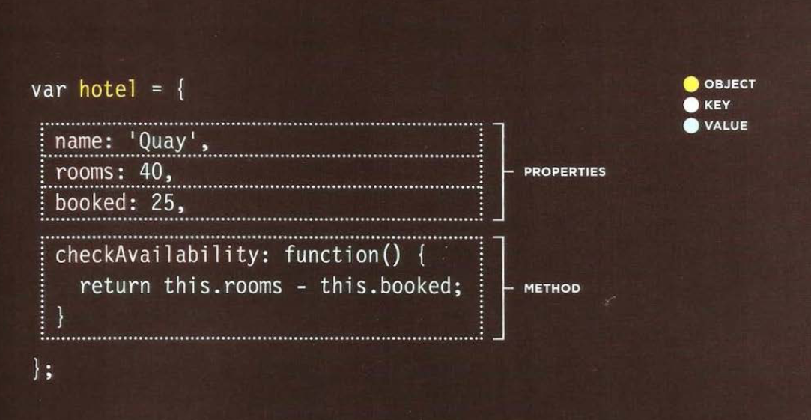
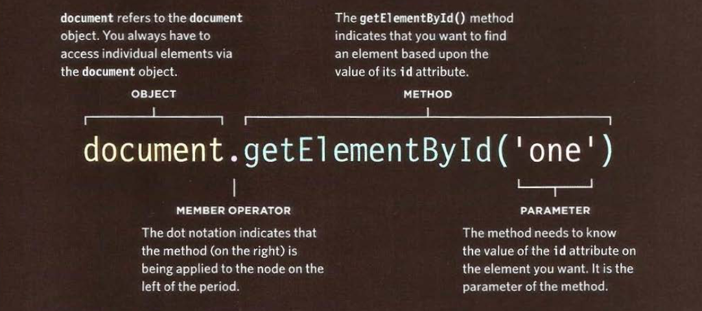

# Understanding The Problem Domain Is The Hardest Part Of Programming

As the title says the most hard thing about programming not the programming language or the technologies but understanding the problem that you are trying to solve.

If you introduce a familiar problem domain to group of coders they will have no issue developing the product that solve the problem.

**Why problem domains are hard?**

Writing code is a lot like putting together a jigsaw puzzle.  We put together code with the purpose of building components that we have taken out of the “bigger picture” of the problem domain.

The big issue is that many problem domains are like a puzzle with a blurry picture or no picture at all.

**What can you do about it?**

1. Make the problem domain easier

You can make the problem easier to understand if you cut down it to little problems that you can understand. and you focus in one of them each time. After solving one problem you go to the other till you finish solving all the little pieces.

2. Get better at understanding the problem domain.

You should make sure to understand the problem from the customer by asking the right questions.

## Object Literals

Objects group together a set of variables and functions to create a model of a something you would recognize from the real world.

- In an object: Variables become known as properties. 
- In an object: Functions become known as methods. 

Example: 
```javascript
var person = {
  firstName: "John",
  lastName: "Doe",
  age: 50,
  eyeColor: "blue"
};
```

**Creating Objects**




**Accessing an Object**


also you can use square brackets to access an object property

`var hotelName = hotel[name];`

## Document Object Model (DOM)

When a web page is loaded, the browser creates a Document Object Model of the page.

With the HTML DOM, JavaScript can access and change all the elements of an HTML document.


### Working with DOM tree 

There are two thing we can so with DOM.

1. locating the node that represent the element that you want to work on.
2. Use it text content, child elements, and attributes.

**Step 1** 

**Finding HTML Elements:**



Method | Description
------- | -------
document.getElementById(id)	| Find an element by element id
document.getElementsByTagName(name)	| Find elements by tag name
document.getElementsByClassName(name)	| Find elements by class name

Finding HTML Elements by CSS Selectors:

If you want to find all HTML elements that match a specified CSS selector (id, class names, types, attributes, values of attributes, etc), use the querySelectorAll() method.
`var x = document.querySelectorAll("p.intro");`


**Navigating Between Nodes**


```
<html> is the root node
<html> has no parents
<html> is the parent of <head> and <body>
<head> is the first child of <html>
<body> is the last child of <html>
<head> has one child: <title>
<title> has one child (a text node): "DOM Tutorial"
<body> has two children: <h1> and <p>
<h1> has one child: "DOM Lesson one"
<p> has one child: "Hello world!"
<h1> and <p> are siblings
```

You can use the following node properties to navigate between nodes with JavaScript:

- parentNode
- childNodes[nodenumber]
- firstChild
- lastChild
- nextSibling
- previousSibling

Example:
`var myTitle = document.getElementById("demo").innerHTML;`

**Step 2** 

- Changing HTML Elements:

Property | Description
--------- | -----------
element.innerHTML =  new html content	| Change the inner HTML of an element
element.attribute = new value	| Change the attribute value of an HTML element
element.style.property = new style	| Change the style of an HTML element
Method	| Description
element.setAttribute(attribute, value)	| Change the attribute value of an HTML element


- Adding and Deleting Elements:

Method	| Description
document.createElement(element)	| Create an HTML element
document.removeChild(element)	| Remove an HTML element
document.appendChild(element)	| Add an HTML element
document.replaceChild(new, old)	| Replace an HTML element
document.write(text)	| Write into the HTML output stream

## Cross Site Scripting (XSS)

If you add HTML to a page using i nnerHTML (or several jQuery methods), you need to be aware of Cross-Site Scripting Attacks or XSS; otherwise, an attacker could gain access to your users' accounts.

Cross-site Scripting (XSS) is a client-side code injection attack. The attacker aims to execute malicious scripts in a web browser of the victim by including malicious code in a legitimate web page or web application. 

### How to Prevent Cross-Site Scripting (XSS) Attacks

1. Escaping

prevent XSS vulnerabilities from appearing in your applications is by escaping user input. Escaping data means taking the data an application has received and ensuring it’s secure before rendering it for the end user.

2. Validating Input

Validating input is the process of ensuring an application is rendering the correct data and preventing malicious data from doing harm to the site, database, and users.

3. Sanitizing

It’s important to use a mix of code review, automated static testing during development and dynamic testing once the application is live, in addition, of course, to using secure coding practices that will help prevent vulnerabilities like cross-site scripting in the first place.