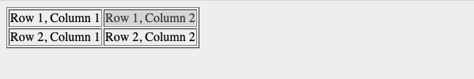
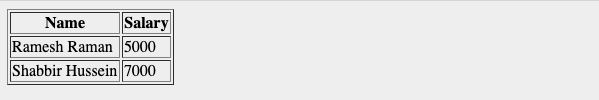

# Domain Modeling

The process of creating a conceptual model in code for a specific problem. A model describes the various entities, their attributes and behaviors, as well as the constraints that govern the problem domain.

## Define a constructor and initialize properties

To define the same properties between many objects, you'll want to use a constructor function.

```javascript
var EpicFailVideo = function (epicRating, hasAnimals) {
  this.epicRating = epicRating;
  this.hasAnimals = hasAnimals;
};

var parkourFail = new EpicFailVideo(7, false);
var corgiFail = new EpicFailVideo(4, true);
```

This is object-oriented programming in JavaScript at its most fundamental level.

- The new keyword instantiates (i.e. creates) an object.
- The constructor function initializes properties inside that object using the this variable.
- The object is stored in a variable for later use.

# HTML Tables

The HTML tables allow to arrange data like text, images, links, other tables.

The HTML tables are created using the `<table>` tag in which the `<tr>` tag is used to create table rows and `<td>` tag is used to create data cells. The elements under `<td>` are regular and left aligned by default

```html
<table>
  <tr>
    <td>Row 1, Column 1</td>
    <td>Row 1, Column 2</td>
  </tr>

  <tr>
    <td>Row 2, Column 1</td>
    <td>Row 2, Column 2</td>
  </tr>
</table>
```



## Table Heading

Table heading can be defined using `<th>` tag.

```html
<table>
  <tr>
    <th>Name</th>
    <th>Salary</th>
  </tr>
  <tr>
    <td>Ramesh Raman</td>
    <td>5000</td>
  </tr>

  <tr>
    <td>Shabbir Hussein</td>
    <td>7000</td>
  </tr>
</table>
```



## Cell padding and Cell spacing Attributes

There are two attributes called cellpadding and cellspacing which you will use to adjust the white space in your table cells. The cellspacing attribute defines space between table cells, while cellpadding represents the distance between cell borders and the content within a cell.

````html
<table border="1" cellpadding="5" cellspacing="5">
  <tr>
    <th>Name</th>
    <th>Salary</th>
  </tr>
  <tr>
    <td>Ramesh Raman</td>
    <td>5000</td>
  </tr>
  <tr>
    <td>Shabbir Hussein</td>
    <td>7000</td>
  </tr>
</table>
```
````

## Colspan and Rowspan Attributes

You will use colspan attribute if you want to merge two or more columns into a single column. Similar way you will use rowspan if you want to merge two or more rows.

```html
<table border="1">
  <tr>
    <th>Column 1</th>
    <th>Column 2</th>
    <th>Column 3</th>
  </tr>
  <tr>
    <td rowspan="2">Row 1 Cell 1</td>
    <td>Row 1 Cell 2</td>
    <td>Row 1 Cell 3</td>
  </tr>
  <tr>
    <td>Row 2 Cell 2</td>
    <td>Row 2 Cell 3</td>
  </tr>
  <tr>
    <td colspan="3">Row 3 Cell 1</td>
  </tr>
</table>
```

## Table Header, Body, and Footer

The three elements for separating the head, body, and foot of a table are −

- `<thead>` − to create a separate table header.

- `<tbody>` − to indicate the main body of the table.

- `<tfoot>` − to create a separate table footer.

````html
<table border="1" width="100%">
  <thead>
    <tr>
      <td colspan="4">This is the head of the table</td>
    </tr>
  </thead>

  <tfoot>
    <tr>
      <td colspan="4">This is the foot of the table</td>
    </tr>
  </tfoot>

  <tbody>
    <tr>
      <td>Cell 1</td>
      <td>Cell 2</td>
      <td>Cell 3</td>
      <td>Cell 4</td>
    </tr>
  </tbody>
</table>
```
````

# Functions, Methods, and Objects”

## Creating a JavaScript Object

Using the JavaScript Keyword new:

```javascript
var person = new Object();
person.firstName = "John";
person.lastName = "Doe";
person.age = 50;
person.eyeColor = "blue";
```

### Updating an object

```javascript
var person = { firstName: "John", lastName: "Doe", age: 50, eyeColor: "blue" };

var x = person;
x.age = 10; // This will change both x.age and person.age
delete person lastname // this will delete the person lastname proberty
```

### Creatin many objects with constructor

```javascript
function Vehicle(name, maker) {
   this.name = name;
   this.maker = maker;
}
let car1 = new Vehicle(’Fiesta’, 'Ford’);
let car2 = new Vehicle(’Santa Fe’, 'Hyundai’)
console.log(car1.name);    //Output: Fiesta
console.log(car2.name);    //Output: Santa Fe
```

### What is this?

The JavaScript this keyword refers to the object it belongs to.

It has different values depending on where it is used:

- In a method, this refers to the owner object.
- Alone, this refers to the global object.
- In a function, this refers to the global object.
- In a function, in strict mode, this is undefined.
- In an event, this refers to the element that received the event.
- Methods like call(), and apply() can refer this to any object.

### Arrays are objects

Objects are an unordered map from string keys to values, arrays are an ordered list of values (with integer keys). That's the main difference. They're both non-primitive, as they're composed of multiple values, which also implies pass-by-reference in JavaScript.

Arrays are also a kind of object, though, so you can attach extra properties to them, access their prototype and so on.

In your revised example, you're only taking advantage of the fact that an array is actually an object, i.e. you can set any property on them. You shouldn't do that. If you don't need an ordered list of values, use a plain object.

### Browser object model

The Browser Object Model (BOM) is used to interact with the browser.

The default object of browser is window means you can call all the functions of window by specifying window or directly.


| Method       | Description                                                                             |
| ------------ | --------------------------------------------------------------------------------------- |
| alert()      | displays the alert box containing message with ok button.                               |
| confirm()    | displays the confirm dialog box containing message with ok and cancel button.           |
| prompt()     | displays a dialog box to get input from the user.                                       |
| open()       | opens the new window.                                                                   |
| close()      | closes the current window.                                                              |
| setTimeout() | performs action after specified time like calling function, evaluating expressions etc. |

Example:

```javascript
//Example of alert() in javascript
function msg() {
  alert("Hello Alert Box");
}

//Example of confirm() in javascript
function msg() {
  var v = confirm("Are u sure?");
  if (v == true) {
    alert("ok");
  } else {
    alert("cancel");
  }
}
```

# Document object model

JavaScript can access all the elements in a webpage making use of Document Object Model (DOM). In fact, the web browser creates a DOM of the webpage when the page is loaded. The DOM model is created as a tree of objects like this:


- Changing HTML Elements:

Property | Description
--------- | -----------
element.innerHTML =  new html content	| Change the inner HTML of an element
element.attribute = new value	| Change the attribute value of an HTML element
element.style.property = new style	| Change the style of an HTML element
Method	| Description
element.setAttribute(attribute, value)	| Change the attribute value of an HTML element


- Adding and Deleting Elements:

Method	| Description
document.createElement(element)	| Create an HTML element
document.removeChild(element)	| Remove an HTML element
document.appendChild(element)	| Add an HTML element
document.replaceChild(new, old)	| Replace an HTML element
document.write(text)	| Write into the HTML output stream

## Global object

In JavaScript, there's always a global object defined. In a web browser, when scripts create global variables, they're created as members of the global object.

###  Strings Object

The String object lets you work with a series of characters; it wraps Javascript's string primitive data type with a number of helper methods.

As JavaScript automatically converts between string primitives and String objects, you can call any of the helper methods of the String object on a string primitive.

`var val = new String(string);`

#### String Properties

Property | Description
--------- | ----------
constructor |	Returns the string's constructor function
length	| Returns the length of a string
prototype	| Allows you to add properties and methods to an object

#### String Methods
Method | Description
------- | --------
charAt()	| Returns the character at the specified index (position)
charCodeAt()	| Returns the Unicode of the character at the specified index
concat()	| Joins two or more strings, and returns a new joined strings
endsWith()	| Checks whether a string ends with specified string/characters
fromCharCode()	| Converts Unicode values to characters
includes()	| Checks whether a string contains the specified string/characters
indexOf()	| Returns the position of the first found occurrence of a specified value in a string
lastIndexOf()	| Returns the position of the last found occurrence of a specified value in a string
localeCompare()	| Compares two strings in the current locale
match()	| Searches a string for a match against a regular expression, and returns the matches
repeat()	| Returns a new string with a specified number of copies of an existing string
replace()	| Searches a string for a specified value, or a regular expression
search()	| Searches a string for a specified value, or regular expression, and returns the position of the match
slice()	| Extracts a part of a string and returns a new string
split()	| Splits a string into an array of substrings
startsWith()	| Checks whether a string begins with specified characters
substr()	| Extracts the characters from a string, beginning at a specified start position
substring()	| Extracts the characters from a string, between two specified indices
toLocaleLowerCase()	| Converts a string to lowercase letters, according to the host's locale
toLocaleUpperCase()	| Converts a string to uppercase letters, according to the host's locale
toLowerCase()	| Converts a string to lowercase letters
toString()	| Returns the value of a String object
toUpperCase()	| Converts a string to uppercase letters
trim()	| Removes whitespace from both ends of a string
valueOf()	| Returns the primitive value of a String object