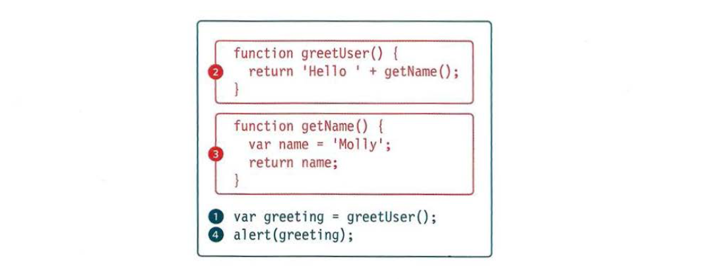

# Error Handling & Debugging

Debugging is a process for testing, finding the errors and reducing them from happening in future.

## Order of execution

To find the source of an error, it helps to know how scripts are processed. The order in which statements are executed can be complex; some tasks cannot complete until another statement or function has been run:



## Execution contexts.

There is one global execution context; plus, each function creates a new new execution context. They correspond to variable scope.

## JavaScript Scope

In JavaScript there are two types of scope:

- Local scope
- Global scope

JavaScript has function scope: Each function creates a new scope.

Scope determines the accessibility (visibility) of these variables.

Variables defined inside a function are not accessible (visible) from outside the function.

### Local JavaScript Variables

Variables declared within a JavaScript function, become LOCAL to the function.

Local variables have Function scope: They can only be accessed from within the function.

```javascript
// code here can NOT use carName

function myFunction() {
  var carName = "Volvo";

  // code here CAN use carName
}
```

### Global JavaScript Variables

A variable declared outside a function, becomes GLOBAL.

A global variable has global scope: All scripts and functions on a web page can access it.

```javascript
var carName = "Volvo";

// code here can use carName

function myFunction() {
  // code here can also use carName
}
```

### The stack

The javascript interpreter processes one line of code at time, When a statment needs data from another function, it stacks the new function on top of the current task.


## Errors

If a JavaScript statement generates an error, then it throws an exception . At that point, the interpreter stops and looks for exception-handling code.

### Error objects

 Error objects can help you find where your mistakes are and browsers have tools to help you read them.

When an Er ror object is created, it will contain the following properties:

PROPERTY | DESCRIPTION 
--------- | ----------
name | Type of execution
message | Description
fileNumber | Name of the JavaScript file 
lineNumber |  Line number of error


There are seven types of built-in error objects in JavaScript. You'll see them on the next two pages:

**EvalError**

Creates an instance representing an error that occurs regarding the global function eval().

**InternalError**

Creates an instance representing an error that occurs when an internal error in the JavaScript engine is thrown. E.g. "too much recursion".

**RangeError**

Creates an instance representing an error that occurs when a numeric variable or parameter is outside of its valid range.

**ReferenceError**

Creates an instance representing an error that occurs when de-referencing an invalid reference.

**SyntaxError**

Creates an instance representing a syntax error.

**TypeError**

Creates an instance representing an error that occurs when a variable or parameter is not of a valid type.

**URIError**

Creates an instance representing an error that occurs when encodeURI() or decodeURI() are passed invalid parameters.

###  How to deal with errors?

1. Debug the script to fix errors 

To debug your script there is nultiple ways to do that, one of them is to use the developer tool thaat comes with your browser

2. Handle errors gracefully 

If you know your code might fail, use try, catch, and finally. Each one is given its own code block.

```javascript
try {
// Try to execute this code
catch (exception) {
// If there is an exception, run this code finally {
}finally{
// This always gets executed
}
```

###  Throwing errors 

If you know something might cause a problem for your script, you can generate your own errors before the interpreter creates them.
